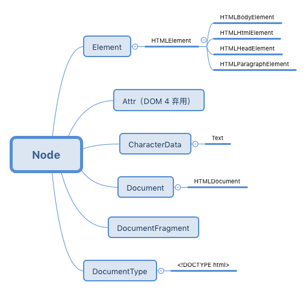

# 节点概述

DOM 的目的是使用 JavaScript 操作为当前文档提供一个编程接口。它最初是个针对 XML 文档的应用编程接口，后来为了在 HTML 文档中使用而被扩展。

## nodeType

每个节点都有 `nodeType` 属性，表示节点的类型。所有的类型在 `Node` 中都被定义为常量，

```js
for (var key in Node) {
  console.log(`${key} = ${Node[key]}`)
}

// => output 

ELEMENT_NODE = 1
ATTRIBUTE_NODE = 2
TEXT_NODE = 3
CDATA_SECTION_NODE = 4
ENTITY_REFERENCE_NODE = 5
ENTITY_NODE = 6
PROCESSING_INSTRUCTION_NODE = 7
COMMENT_NODE = 8
DOCUMENT_NODE = 9
DOCUMENT_TYPE_NODE = 10
DOCUMENT_FRAGMENT_NODE = 11
NOTATION_NODE = 12
DOCUMENT_POSITION_DISCONNECTED = 1
DOCUMENT_POSITION_PRECEDING = 2
DOCUMENT_POSITION_FOLLOWING = 4
DOCUMENT_POSITION_CONTAINS = 8
DOCUMENT_POSITION_CONTAINED_BY = 16
DOCUMENT_POSITION_IMPLEMENTATION_SPECIFIC = 32
```

## 继承自 `Node` 的子节点对象



## 操控节点的属性和方法

下面是最常见的属性和方法

Node 属性

- childNodes, firstChild, lastChild, nextSibling, parentNode, previousSibling
- nodeName, nodeType, nodeValue

Node 方法

- appendChild()
- cloneNode()
- compareDocumentPosition()
- contains()
- hasChildNodes()
- insertBefore()
- isEqualNode()
- removeChild()
- replaceChild()

Document 方法

- document.createElement()
- document.createTextNode()

HTML*Element 属性

- innerHTML, outerHTML
- textContent, innerText, outerText
- firstElementChild, lastElementChild, nextElementChild, previousElementChild
- children

HTML*Element 方法

- insertAdjacentHTML()

## 识别节点的 type 和 name

```html
<a href="#">Hello DOM!</a>
```

```js
console.log(
    document.doctype.nodeName,
    document.doctype.nodeType
)

console.log(
    document.nodeName,
    document.nodeType
)

console.log(
    document.createDocumentFragment().nodeName,
    document.createDocumentFragment().nodeType
)

console.log(
    document.querySelector('a').nodeName,
    document.querySelector('a').nodeType
)

console.log(
    document.querySelector('a').firstChild.nodeName,
    document.querySelector('a').firstChild.nodeType
)

// => 

html 10
#document 9
#document-fragment 11
A 1
#text 3
```

判断某个节点是否某种类型最快的方法就是直接检查它的 `nodeType` 属性。

## 获取节点值

绝大多数节点类型（除 Text 和 Comment）的 `nodeValue` 属性都返回 `null`。它的作用就是获取 `Text` 和 `Comment` 节点实际文本字符串。

```js
var items = [
  document.doctype,
  document,
  document.createDocumentFragment(),
  document.querySelector('a'),
  document.querySelector('a').firstChild
]

items.forEach(item => console.log(item.nodeValue))

// => 
null
null
null
null
Hello DOM!
```

## 使用 JavaScript 创建 element 和 text 节点

```js
var elementNode = document.createElement('div')
console.log(elementNode, elementNode.nodeType)

var textNode = document.createTextNode('Hi')
console.log(textNode, textNode.nodeType)

// => 
<div></div> 1
"Hi" 3
```

## 使用字符串向 DOM 创建添加 element 和 text 节点

```html
<div id="A"></div>
<span id="B"></span>
<div id="C"></div>
<div id="D"></div>
<div id="E"></div>
```

```js
const $ = el => document.getElementById(el)

$('A').innerHTML = '<strong>Hi</strong>'
$('B').outerHTML = '<div id="B" class="new">Whats shaking</div>'
$('C').textContent = 'dude'
// innerText 和 outerText 是非标准的扩展
$('D').innerText = 'Keep it'
$('E').outerText = 'real!'

console.log(document.body.innerHTML)

// => 
`<div id="A"><strong>Hi</strong></div>
<div id="B" class="new">Whats shaking</div>
<div id="C">dude</div>
<div id="D">Keep it</div>
real!`
```

`insertAdjacentHtmL()` 方法更精准，仅在 Element 节点上有效。

```html
<i id="elm">最近</i>
```

```js
const elm = document.getElementById('elm')

elm.insertAdjacentHTML('beforebegin', '<span>你好 - </span>')
elm.insertAdjacentHTML('afterbegin', '<span>年轻人 - </span>')
elm.insertAdjacentHTML('beforeend', '<span> - 怎么</span>')
elm.insertAdjacentHTML('afterend', '<span> - 样？</span>')

console.log(document.body.innerHTML)

// => 

"<span>你好 - </span><i id="elm"><span>年轻人 - </span>最近<span> - 怎么</span></i><span> - 样？</span>"
```

`insertAdjacentHTML` 只有该节点位于 DOM 中，并且有父节点时才有效。

## 提取部分 DOM 树作为字符串

```html
<div id="A"><i>Hi</i></div>
<div id="B">Dude<strong> !</strong></div>
```

```js
const $ = el => document.querySelector(el)

const $A = $('#A')
const $B = $('#B')

console.log($A.innerHTML)
console.log($A.outerHTML)

console.log($B.textContent)
console.log($B.innerText)
console.log($B.outerText)

// => 
<i>Hi</i>
<div id="A"><i>Hi</i></div>
Dude !
Dude !
Dude !
```